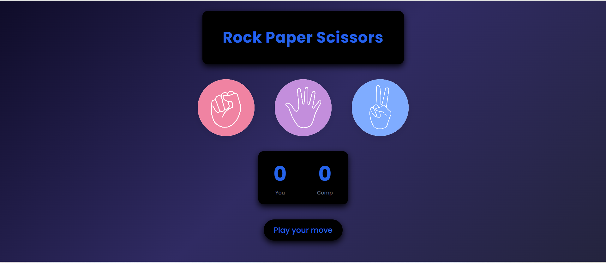

# Rock Paper Scissors Game

A modern, responsive Rock Paper Scissors game built using **HTML, CSS, and Vanilla JavaScript**.

This project demonstrates DOM manipulation, event handling, game logic implementation, and responsive UI design.

---

##  Features

- Interactive Rock, Paper, Scissors gameplay
- Random computer choice generation
- Real-time score tracking
- Win / Lose / Draw message updates
- Responsive design (mobile + desktop friendly)
- Clean modern UI

---

##  Technologies Used

- HTML5
- CSS3 (Flexbox, Responsive Design)
- JavaScript (DOM Manipulation, Event Listeners)

---

##  How It Works

1. User selects Rock, Paper, or Scissors.
2. Computer generates a random choice.
3. Game logic compares selections.
4. Scores update automatically.
5. Result message is displayed dynamically.

---

##  Project Structure

Rock-Paper-Scissors/
│
├── index.html
├── style.css
├── script.js
└── images/
├── rock.png
├── paper.png
└── scissors.png

---

##  Preview

 

##  Concepts Practiced

- Query Selectors
- Event Listeners
- Conditional Logic
- Functions
- Responsive UI Design
- State Management

---

## 🌍 Live Demo

(Add your GitHub Pages link here)

---

## 📌 Future Improvements

- Add sound effects
- Add reset button
- Add animations
- Add dark mode toggle
- Add score persistence using Local Storage

---

## 👨‍💻 Author

Mohammed Sharib  
AI Engineering Student | Web Development Enthusiast  

